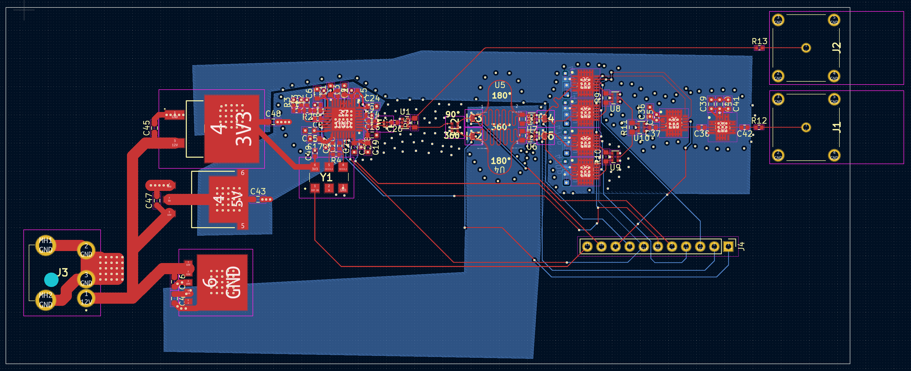

# 5GHzPhaseShifter
 A 5GHz narrowband attenuator based vector summing phase shifter with two different attentuator types for evaluation purposes. This was never built or tested as I found a 1.7-2.2GHz option for cheaper. You will likely have to open the image in a new tab to resolve all of the detail.

